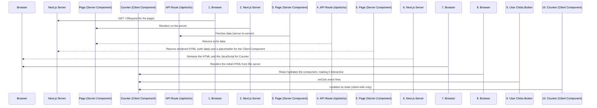

# Next.js React Server Components Example

This is a minimal example of a Next.js application using React Server Components (RSC).

## Project Structure

- `app/page.tsx`: The main page, which is a Server Component that fetches data from the echo API.
- `app/_components/Counter.tsx`: A Client Component that includes an interactive counter.
- `app/api/echo/route.ts`: An API route that provides an echo service.
- `package.json`: Defines the project dependencies.
- `next.config.mjs`: Next.js configuration file.
- `tsconfig.json`: TypeScript configuration file.

## Getting Started

1. **Install dependencies:**
   ```bash
   npm install
   ```

2. **Run the development server:**
   ```bash
   npm run dev
   ```

Open [http://localhost:3001](http://localhost:3001) with your browser to see the result.

### Accessing the Echo API

You can also access the echo API endpoint directly using `curl`:

```bash
curl "http://localhost:3001/api/echo?message=YourMessageHere"
```

This will return a JSON response like:
```json
{"echo":"YourMessageHere"}
```

### Accessing the Users API

This project includes a set of API endpoints for managing users.

- **GET /api/users**

  Retrieves a list of users.

  ```bash
  curl "http://localhost:3001/api/users"
  ```

- **POST /api/users**

  Creates a new user.

  ```bash
  curl -X POST "http://localhost:3001/api/users" \
       -H "Content-Type: application/json" \
       -d '{"name": "Jane Doe", "email": "jane.doe@example.com"}'
  ```

- **GET /api/users/{id}**

  Retrieves a single user by their ID.

  ```bash
  curl "http://localhost:3001/api/users/your-user-id"
  ```

---

## Architecture Overview

This project demonstrates the hybrid rendering power of Next.js with the App Router, combining Server Components and Client Components. Here’s a breakdown of how a request is handled:



### Flow Explanation:

1.  **Initial Request**: The browser sends a request to the Next.js server for the root page (`/`).
2.  **Server-Side Rendering**:
    *   The Next.js server finds the corresponding page, `app/page.tsx`, which is a **Server Component**.
    *   This component begins to render **on the server**.
    *   During its render, it makes a `fetch` call to the `/api/echo` route. Since both are on the same server, this is a fast, internal network request.
    *   The API route processes the request and sends back a JSON response.
    *   The Server Component finishes rendering its HTML, now including the data fetched from the API.
3.  **Streaming to Browser**: The server streams the fully rendered HTML for the Server Component to the browser. It also includes a reference telling the browser to load the JavaScript for any **Client Components** on the page (in this case, `<Counter />`).
4.  **Hydration**:
    *   The browser displays the received HTML immediately, so the user sees the content very quickly (great for SEO and perceived performance).
    *   The browser then downloads the small JavaScript bundle for the `Counter` component.
    *   React runs a process called "hydration," which attaches the JavaScript logic (like `useState` and `onClick` handlers) to the already-rendered HTML of the counter, making it interactive.
5.  **Client-Side Interaction**: When the user clicks the counter button, the `onClick` event is handled entirely in the browser by the `Counter` component's JavaScript. It updates its own state and re-renders without needing to contact the server again.

This architecture provides the best of both worlds: the fast initial load and SEO benefits of server-side rendering, combined with the rich interactivity of a client-side application.

---

## Key Differences from a Standard React App

This Next.js project differs from a traditional client-side rendered (CSR) React app (e.g., one made with Create React App) primarily in **where components render** and **how data is fetched**, thanks to the React Server Components (RSC) architecture.

### 1. Component Types and Rendering Location

-   **Standard React (CSR)**: All components are "client components." Their code is bundled into JavaScript, sent to the browser, and rendered into HTML on the user's device. This means even for static content, the user must download and execute the entire app's JS bundle.
-   **Next.js with RSC (Hybrid Rendering)**:
    -   **Server Components**: The default in the Next.js `app` directory (like `app/page.tsx`). These components run **only on the server** to generate HTML or data. Their JavaScript code is **not** sent to the browser, which reduces the client-side bundle size and speeds up initial page loads.
    -   **Client Components**: You opt into these only when you need interactivity (like `onClick`, `useState`, `useEffect`). You mark them with the `'use client';` directive at the top of the file (like `app/_components/Counter.tsx`). Their code is sent to the browser and executed there, just like in a traditional React app.

### 2. Data Fetching

-   **Standard React**: Data fetching is typically done on the client side. After a component mounts, it uses `useEffect` to make one or more API calls (`fetch`). This can lead to multiple round-trips between the client and server and often requires showing loading spinners.
-   **Next.js with RSC**: Server Components can access data sources (databases, file systems, external APIs) directly on the server, even using `async/await` syntax within the component itself. This allows data to be fetched and rendered into the HTML before it's sent to the client, reducing client-side requests and improving performance.

### Summary of Differences

| Feature | Standard React (e.g., CRA) | Next.js with RSC |
| :--- | :--- | :--- |
| **Rendering** | Primarily Client-Side | Hybrid (Server & Client) |
| **Components** | All are Client Components | Server Components by default, Client Components as needed |
| **Data Fetching** | Client-side (`useEffect` + `fetch`) | Server-side (`async/await` in component) |
| **Performance** | Larger JS bundle, slower initial load | Smaller JS bundle, faster initial load |
| **SEO** | Requires extra setup (e.g., SSR) | SEO-friendly out-of-the-box |

In short, this Next.js project intelligently divides the work between the server and the client to achieve better performance, faster load times, and an improved developer experience, especially for data-driven applications.
